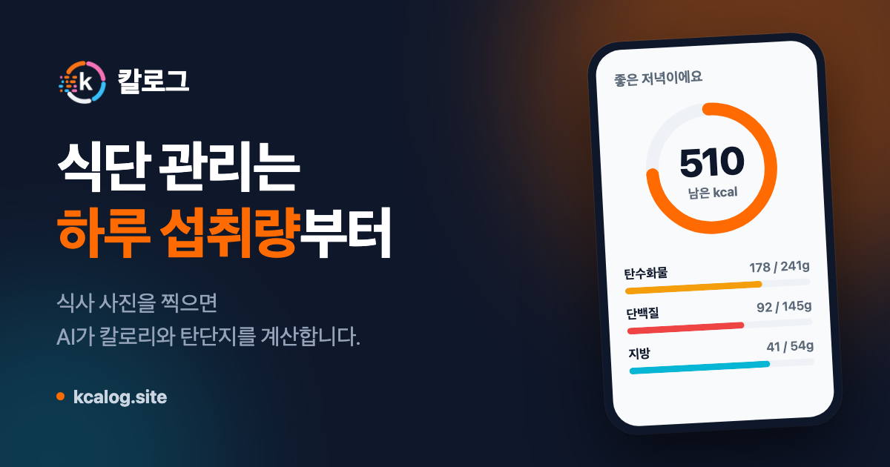
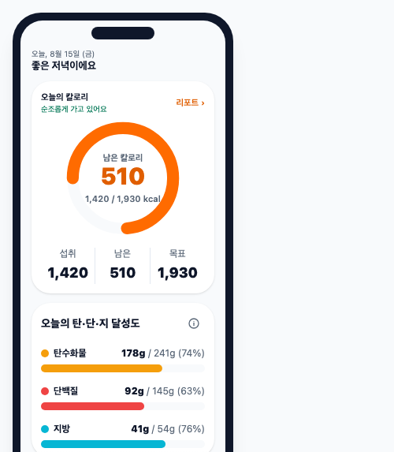
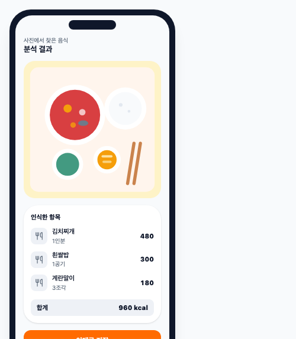
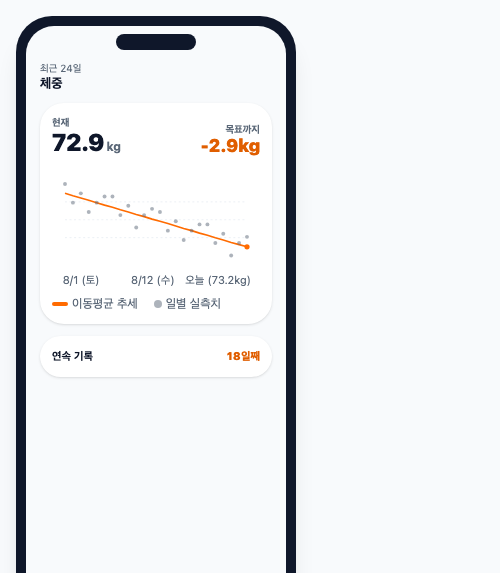
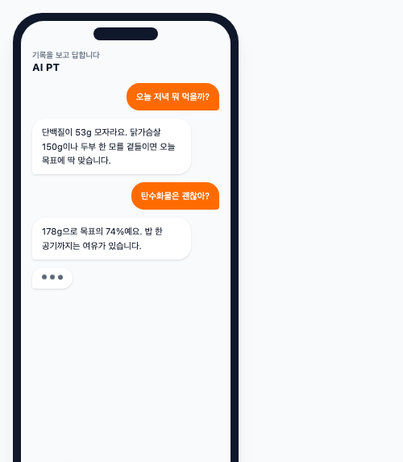

### 식단 관리는 하루 섭취량부터

식사 사진을 찍으면 AI가 칼로리와 탄단지를 계산합니다. 
쌓인 기록으로 하루 목표를 내 몸에 맞게 고쳐 나갑니다.

**[칼로그 쓰러 가기](https://kcalog.site)**

 

 

## 목차

- [무엇을 푸는가](#무엇을-푸는가)
- [화면](#화면)
- [기능](#기능)
- [신경 쓴 것](#신경-쓴-것)

 

## 무엇을 푸는가

칼로리 앱을 써본 사람들이 가장 많이 하는 말은 "계산대로 먹었는데 안 빠져요"다.

공식으로 낸 유지 칼로리는 사람마다 10에서 15% 어긋난다. 2,500이라고 나와도 실제는 2,200일 수도 2,800일 수도 있고, 활동량을 한 칸 다르게 고르면 400kcal가 움직인다. 그런데 **대부분의 앱은 처음 계산한 그 추정값을 끝까지 쓴다.**

칼로그는 2주치 식사와 체중이 쌓이면 실제로 먹은 양과 체중 변화로 역산해 유지 칼로리를 다시 계산한다. 공식이 아니라 그 사람 몸에서 나온 값이다.

기록이 쌓여야 가능한 일이라, 기록을 최대한 가볍게 만드는 것이 나머지 절반이다. 검색창도 그램 수 입력도 없이 사진 한 장이면 끝난다.

 

## 화면

| 홈 | 음식기록 | 체중 | AI PT |
| :-: | :-: | :-: | :-: |
|  |  |  |  |
| 남은 칼로리와 탄단지 | 사진에서 찾은 음식 | 흔들리는 기록 위의 추세선 | 기록을 읽고 답하는 코치 |

 

## 기능

| | |
| :-- | :-- |
| **식사 기록** | 사진 업로드, 비동기 AI 분석, 음식별 배지를 눌러 확인하고 수정, 저장 |
| **학습하는 수정** | 고친 값을 개인 보정치로 기억해 다음 인식에 반영 |
| **하루 목표** | 카카오 로그인, 프로필로 유지 칼로리와 탄단지 목표를 계산 |
| **실측 유지 칼로리** | 2주치 섭취량과 체중 추세로 역산해 목표를 다시 잡도록 제안 |
| **체중** | 일별 기록과 이동평균 추세선, 목표까지 남은 양 |
| **주간 리포트** | 한 주 동안 무엇이 달라졌는지 정리 |
| **AI PT** | 기록을 근거로 오늘 무엇을 더 먹으면 좋을지 답하는 코치 |

 

## 신경 쓴 것

**사진 분석을 요청 안에서 끝내지 않는다.** Vision 호출은 몇 초가 걸리고 실패도 한다. 업로드하면 작업을 만들어 즉시 응답하고, 클라이언트가 상태를 폴링한다. 화면은 분석 중, 성공, 실패, 재시도 네 상태를 각각 그린다.

**유지 칼로리를 공식이 아니라 실측으로.** 최근 14일 창에서 식사 기록이 80% 이상이고 체중 기록 간격이 10일 이상이면, 섭취량과 체중 추세로 역산한 값으로 갈아탄다. 조건을 못 채우면 공식 추정값을 유지하고 왜 아직인지 알려준다.

**단백질을 체중에서 정한다.** 대부분의 앱이 쓰는 "칼로리의 30%" 방식은 많이 먹는 사람에게 체중 1kg당 2.8g 같은 값을 준다. 단백질을 체중에서 먼저 잡고(1kg당 1.2에서 2.0g), 지방을 25%로 두고, 남은 칼로리를 탄수화물이 받는다.

**스펙을 먼저 쓴다.** 기능 작업은 `openspec/changes/<name>/`의 proposal, design, specs, tasks 순서를 따른다. 구현 중 설계와 어긋나는 결정을 하면 design.md에 이유와 함께 남긴다.

**감시자를 감시 대상과 분리한다.** 앱 서버가 죽으면 모니터링도 같이 죽어서는 안 되므로 VM을 나눴다. 로그와 지표는 앱 서버의 Alloy가 밀어 보낸다.

**통합 테스트는 컨테이너를 하나만 띄운다.** `@IntegrationTest` 메타 어노테이션으로 구성을 통일해 Testcontainers 컨테이너를 공유한다. 커버리지는 측정만 하고 게이트를 걸지 않는다. 숫자를 채우려고 쓰는 테스트를 막기 위해서다.

---

1인 개발 사이드 프로젝트입니다. 기능과 화면은 계속 바뀝니다.

기능 범위와 요구사항은 `openspec/`이 기준입니다.

