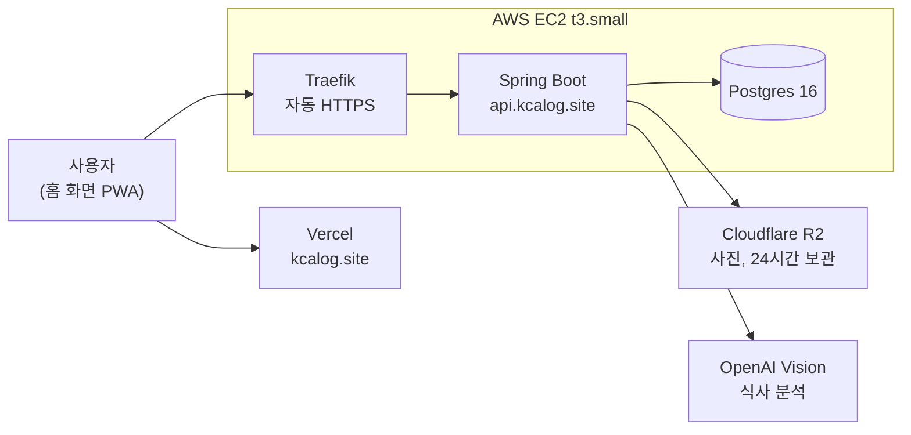
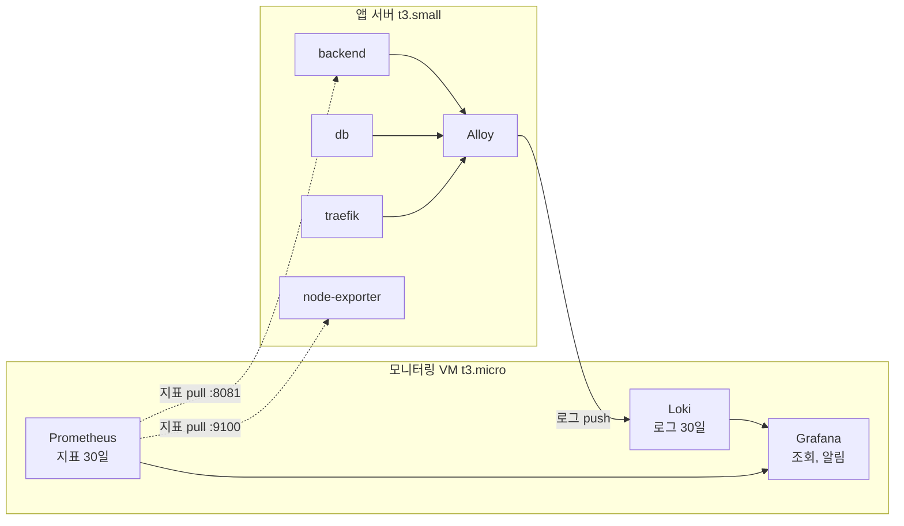

<div align="center">


### 식단 관리는 하루 섭취량부터

식사 사진을 찍으면 AI가 칼로리와 탄단지를 계산합니다.<br />
쌓인 기록으로 하루 목표를 내 몸에 맞게 고쳐 나갑니다.

**[칼로그 쓰러 가기](https://kcalog.site)**

<br />


</div>

<br />

## 목차

- [무엇을 푸는가](#무엇을-푸는가)
- [화면](#화면)
- [기능](#기능)
- [기술 스택](#기술-스택)
- [아키텍처](#아키텍처)
- [신경 쓴 것](#신경-쓴-것)
- [로컬 실행](#로컬-실행)
- [테스트](#테스트)
- [배포](#배포)
- [모니터링](#모니터링)

<br />

## 무엇을 푸는가

칼로리 앱을 써본 사람들이 가장 많이 하는 말은 "계산대로 먹었는데 안 빠져요"다.

공식으로 낸 유지 칼로리는 사람마다 10에서 15% 어긋난다. 2,500이라고 나와도 실제는 2,200일 수도 2,800일 수도 있고, 활동량을 한 칸 다르게 고르면 400kcal가 움직인다. 그런데 **대부분의 앱은 처음 계산한 그 추정값을 끝까지 쓴다.**

칼로그는 2주치 식사와 체중이 쌓이면 실제로 먹은 양과 체중 변화로 역산해 유지 칼로리를 다시 계산한다. 공식이 아니라 그 사람 몸에서 나온 값이다.

기록이 쌓여야 가능한 일이라, 기록을 최대한 가볍게 만드는 것이 나머지 절반이다. 검색창도 그램 수 입력도 없이 사진 한 장이면 끝난다.

<br />

## 화면

| 홈 | 음식기록 | 체중 | AI PT |
| :-: | :-: | :-: | :-: |
|  |  |  |  |
| 남은 칼로리와 탄단지 | 사진에서 찾은 음식 | 흔들리는 기록 위의 추세선 | 기록을 읽고 답하는 코치 |

<br />

## 기능

| | |
| :-- | :-- |
| **식사 기록** | 사진 업로드, 비동기 AI 분석, 음식별 배지를 눌러 확인하고 수정, 저장 |
| **학습하는 수정** | 고친 값을 개인 보정치로 기억해 다음 인식에 반영 |
| **하루 목표** | 카카오 로그인, 프로필로 유지 칼로리와 탄단지 목표를 계산 |
| **실측 유지 칼로리** | 2주치 섭취량과 체중 추세로 역산해 목표를 다시 잡도록 제안 |
| **체중** | 일별 기록과 이동평균 추세선, 목표까지 남은 양 |
| **주간 리포트** | 한 주 동안 무엇이 달라졌는지 정리 |
| **AI PT** | 기록을 근거로 오늘 무엇을 더 먹으면 좋을지 답하는 코치 |

<br />

## 기술 스택

| 영역 | |
| :-- | :-- |
| **Frontend** |      |
| **Backend** |     |
| **Database** |    |
| **AI** |  |
| **Infra** |       |
| **Monitoring** |    |

<br />

## 아키텍처



모노레포다.

```
kcalog/
├── frontend/   Vite 8 + React 19 + TypeScript SPA (PWA)
├── backend/    Spring Boot 4 + JPA + Postgres + Flyway
├── eval/       식사 분석 프롬프트 평가 세트 (음식 사진 + 기대값)
├── deploy/     운영 구성 (compose, Traefik, 모니터링 스택, 백업)
└── openspec/   스펙 주도 개발 (OpenSpec)
```

백엔드 패키지는 `com.kcalog.domain.{도메인}.{controller, service, repository, entity, dto}` + `com.kcalog.global.{config, common}` 구조다. 도메인은 auth, member, meal, weight, workout, report.

<br />

## 신경 쓴 것

**사진 분석을 요청 안에서 끝내지 않는다.** Vision 호출은 몇 초가 걸리고 실패도 한다. 업로드하면 작업을 만들어 즉시 응답하고, 클라이언트가 상태를 폴링한다. 화면은 분석 중, 성공, 실패, 재시도 네 상태를 각각 그린다.

**유지 칼로리를 공식이 아니라 실측으로.** 최근 14일 창에서 식사 기록이 80% 이상이고 체중 기록 간격이 10일 이상이면, 섭취량과 체중 추세로 역산한 값으로 갈아탄다. 조건을 못 채우면 공식 추정값을 유지하고 왜 아직인지 알려준다.

**단백질을 체중에서 정한다.** 대부분의 앱이 쓰는 "칼로리의 30%" 방식은 많이 먹는 사람에게 체중 1kg당 2.8g 같은 값을 준다. 단백질을 체중에서 먼저 잡고(1kg당 1.2에서 2.0g), 지방을 25%로 두고, 남은 칼로리를 탄수화물이 받는다.

**스펙을 먼저 쓴다.** 기능 작업은 `openspec/changes/<name>/`의 proposal, design, specs, tasks 순서를 따른다. 구현 중 설계와 어긋나는 결정을 하면 design.md에 이유와 함께 남긴다.

**감시자를 감시 대상과 분리한다.** 앱 서버가 죽으면 모니터링도 같이 죽어서는 안 되므로 VM을 나눴다. 로그와 지표는 앱 서버의 Alloy가 밀어 보낸다.

**통합 테스트는 컨테이너를 하나만 띄운다.** `@IntegrationTest` 메타 어노테이션으로 구성을 통일해 Testcontainers 컨테이너를 공유한다. 커버리지는 측정만 하고 게이트를 걸지 않는다. 숫자를 채우려고 쓰는 테스트를 막기 위해서다.

<br />

## 로컬 실행

```bash
docker compose up -d                 # Postgres 16 (:5432) + MinIO (:9000 API / :9001 콘솔)
cd backend && ./gradlew bootRun      # API 서버 :8080
cd frontend && npm run dev           # dev 서버 :5173 (/api → :8080 proxy)
```

DB와 사진 스토리지(MinIO)까지 환경변수 없이 docker-compose 기본값으로 동작한다. 버킷은 최초 저장 시 자동 생성된다.

| 필요한 키 | 없으면 |
| :-- | :-- |
| `OPENAI_API_KEY` | AI 식사 분석만 에러, 나머지는 정상 동작 |
| `KAKAO_CLIENT_ID` / `KAKAO_CLIENT_SECRET` | 로그인 테스트 불가 |
| `STORAGE_*` | 운영 필수 (로컬은 MinIO 기본값) |

`.env.example`을 `.env`로 복사해 채운다. 시크릿은 코드나 문서에 하드코딩하지 않는다.

<br />

## 테스트

```bash
cd backend && ./gradlew test         # Docker 데몬만 켜져 있으면 됨 (Testcontainers)
cd frontend && npm test              # vitest
```

순수 도메인 로직(계산, 판정)은 TDD로 간다. 스펙 시나리오를 실패하는 테스트로 먼저 옮긴 뒤 구현한다. 프레임워크 배선 코드는 test-after를 허용한다.

<br />

## 배포

```
kcalog.site       → Vercel (프론트)
api.kcalog.site   → AWS EC2 (t3.small)
                      └ docker compose: Traefik(자동 HTTPS) + backend + Postgres 16
사진               → Cloudflare R2 (S3 호환, 24시간 보관)
백업               → 매일 pg_dump → R2 (deploy/backup.sh, 14일 보관)
```

**배포는 `release` 브랜치에 들어왔을 때만 일어난다.** main 머지는 배포하지 않는다. 프론트만 먼저 나가면 아직 없는 API를 부르는 화면이 운영에 뜬다.

```bash
git checkout release && git merge main && git push origin release
```

`.github/workflows/deploy.yml`이 백엔드 이미지를 ghcr.io에 올리고 SSH로 VM에 배포한 뒤 `https://api.kcalog.site/actuator/health`로 기동을 확인한다. 실패하면 워크플로우가 실패한다. 프론트는 Vercel의 Production Branch가 `release`라 Git 연동이 같은 시점에 배포한다.

<details>
<summary><b>운영에서 지킬 것</b></summary>

<br />

- **`release` 브랜치 = 지금 운영에 떠 있는 코드.** 이미지는 커밋 SHA로 태깅되고, 배포 커밋은 워크플로우 실행 요약에 남는다.
- **롤백**: 되돌릴 커밋을 `release`에 올린다 (`git revert` 후 push, 또는 이전 커밋으로 되돌려 push).
- **핫픽스를 `release`에 직접 얹었다면 반드시 main으로 역머지한다.** 빼먹으면 다음 릴리스에서 수정이 사라진다.
- 운영 구성 파일은 `deploy/`에 있다 (`compose.prod.yml`, `backup.sh`). 라우팅과 인증서는 Traefik이 backend 서비스의 도커 라벨을 읽어 구성하고, `acme.json`은 네임드 볼륨 안에서 Traefik이 직접 만든다(사전 준비 불필요).
- 🔴 **운영에서 `docker compose down -v` 금지.** 로컬 DB 초기화 습관대로 치면 운영 데이터(`db-data`)와 인증서(`traefik-acme`)가 함께 지워진다.
- 시크릿은 GitHub Secrets에 두고 배포 시 VM의 `.env`로 주입한다. 항목은 `.env.example` 참고.
- 프론트와 백엔드가 다른 출처라 `CORS_ALLOWED_ORIGINS`가 **운영 필수**다. 서브도메인이라 same-site여서 refresh 쿠키(`SameSite=Lax`)는 그대로 동작한다.
- Vercel 프리뷰 배포(`*.vercel.app`)는 도메인이 달라 **로그인이 동작하지 않는다.** 화면 확인용으로만 쓴다.
- 🔴 **운영 배포 이후 적용된 Flyway 마이그레이션은 수정 금지** (체크섬 불일치로 기동 실패). 항상 새 버전 파일로.

전체 절차와 수동 준비 작업(도메인, DNS, VM, R2, 카카오 설정)은 `openspec/changes/add-deployment/tasks.md` 참고.

</details>

<br />

## 모니터링



감시자는 감시 대상과 함께 죽으면 안 되므로 **서버를 나눈다.** 구성은 `deploy/monitoring/`에 있고, 앱 서버 쪽 Alloy와 node-exporter는 `deploy/compose.prod.yml`에 있어 배포 워크플로가 함께 올린다.

<details>
<summary><b>보는 방법과 고치는 방법</b></summary>

<br />

Grafana는 인터넷에 열지 않는다. **Tailscale 안에서만** 보인다.

```
http://<모니터링 VM의 Tailscale 주소>:3000
```

평소 보는 화면은 대시보드 `kcalog 운영` 하나다. 위 두 칸(백엔드 상태, 최근 5분 에러)으로 정상 여부를 판단하고, 이상하면 아래로 내려가 좁힌 뒤 오른쪽 아래 로그 패널에서 끝낸다.

한 요청을 따라갈 때는 응답 헤더의 `X-Request-Id`를 쓴다.

```
{app="kcalog"} | json | requestId = "a1b2c3d4e5f6"
```

⚠️ **스택 트레이스가 담긴 줄에는 요청 식별자가 없다.** Tomcat이 필터 바깥에서 찍기 때문이다. 그때는 같은 스레드로 잇는다.

```
{app="kcalog"} | json | process_thread_name = "http-nio-8080-exec-3"
```

**구성을 고칠 때**

- 구성 파일은 **레포가 원본이다.** 급해서 서버에서 직접 고쳤다면 반드시 레포에 반영한다. `release` 역머지 누락과 같은 종류의 위험이고, 빼먹으면 서버를 다시 세울 때 사라진다.
- 대시보드(`deploy/monitoring/dashboards/*.json`)는 **화면에서 저장할 수 없다.** 파일을 고치면 새로고침으로 반영된다. 자유롭게 실험하려면 Grafana에서 새 대시보드를 만들어 쓰고, 쓸 만해지면 내보내 이 폴더에 넣는다.
- 로컬에서 그대로 띄워 확인할 수 있다. 환경마다 다른 값은 전부 `.env`로 빠져 있어 파일은 같다.

```bash
cd deploy/monitoring && docker compose --profile local up -d
```

- 🔴 `loki.yml`의 `compactor.retention_enabled`를 끄지 말 것. 끄면 로그가 영원히 쌓이고, 디스크가 차면 **Loki는 죽는 대신 로그를 못 받는 상태로 조용히 버틴다.**

자세한 결정 근거는 `openspec/changes/add-observability/design.md` 참고.

</details>

<br />

---

<div align="center">

1인 개발 사이드 프로젝트입니다. 기능과 화면은 계속 바뀝니다.

기능 범위와 요구사항은 `openspec/`이 기준입니다.

</div>
